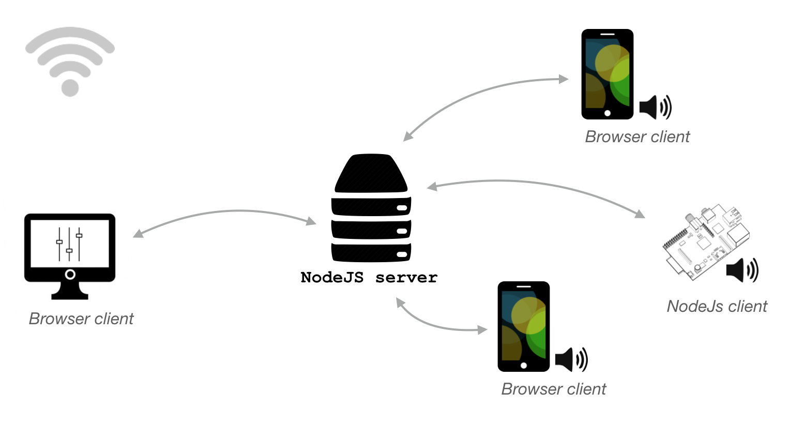
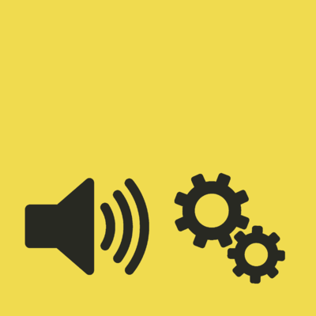

# `soundworks`

<!--  -->

`soundworks` is on open-source creative coding framework for distributed applications based on Web technologies.

Visit [https://soundworks.dev](https://soundworks.dev) for more informations.

## Credits

The development of `soundworks` is conducted in the [Sound Music Movement Interaction Team](https://www.stms-lab.fr/team/interaction-son-musique-mouvement/) from the Ircam's STMS-LAB.

